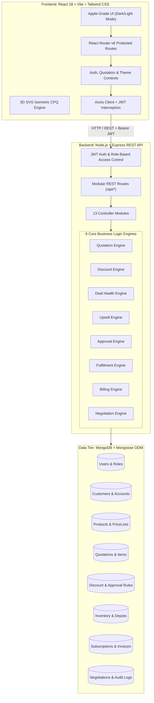

# DealFlow360 — Enterprise CPQ & Deal Lifecycle Operating System

> **DealFlow360** is an enterprise-grade Configure, Price, Quote (CPQ) and Deal Lifecycle Management platform. It unifies sales quotation generation, dynamic discount governance, AI-driven deal health risk scoring, multi-tier approval chains, split-warehouse order fulfillment, subscription billing with mid-cycle proration, automated invoicing, customer counter-offer negotiation, and executive analytics into a deterministic, single-source-of-truth operating system.

---

## Table of Contents

1. [Executive Summary & Problem Statement](#1-executive-summary--problem-statement)
2. [High-Level Architecture & Tech Stack](#2-high-level-architecture--tech-stack)
3. [Core Business Engines & Mathematical Formulas](#3-core-business-engines--mathematical-formulas)
   - [3.1 Quotation & Pricing Engine](#31-quotation--pricing-engine)
   - [3.2 Dynamic Discount Engine](#32-dynamic-discount-engine)
   - [3.3 Deal Health & Risk Scoring Engine](#33-deal-health--risk-scoring-engine)
   - [3.4 Upsell & Cross-Sell Recommendation Engine](#34-upsell--cross-sell-recommendation-engine)
   - [3.5 Multi-Tier Approval Governance Engine](#35-multi-tier-approval-governance-engine)
   - [3.6 Warehouse Allocation & Split Fulfillment Engine](#36-warehouse-allocation--split-fulfillment-engine)
   - [3.7 Subscription Billing & Mid-Cycle Proration Engine](#37-subscription-billing--mid-cycle-proration-engine)
   - [3.8 Customer Negotiation & Redline Engine](#38-customer-negotiation--redline-engine)
4. [Master Directory & File Manifest](#4-master-directory--file-manifest)
5. [The 18 Enterprise Wireframes & Screen Mappings](#5-the-18-enterprise-wireframes--screen-mappings)
6. [Data Tier & Mongoose Models](#6-data-tier--mongoose-models)
7. [REST API Contracts & Endpoints](#7-rest-api-contracts--endpoints)
8. [Security, Authentication & RBAC](#8-security-authentication--rbac)
9. [Installation, Seeding & Development Guide](#9-installation-seeding--development-guide)
10. [Comprehensive Master Q&A (35+ Questions & Answers)](#10-comprehensive-master-qa)

---

## 1. Executive Summary & Problem Statement

In mid-market and enterprise B2B sales organizations, the traditional **Quote-to-Cash (QTC)** cycle suffers from critical operational friction:

| Pain Point | Traditional Impact | DealFlow360 Solution |
| :--- | :--- | :--- |
| **Rogue Discounting** | Sales reps apply ad-hoc discounts in spreadsheets, causing margin erosion. | Deterministic volume discount curves, customer-tier bonuses, and hard approval gates capped at 70%. |
| **Approval Bottlenecks** | Quotes stall in email threads waiting for managers and finance teams to review exceptions. | Automated multi-stage approval routing (Manager -> Finance -> VP/CFO) with SLA tracking. |
| **Fulfillment Disconnects** | Contracts are signed without real-time inventory visibility, resulting in unexpected stockouts. | Real-time multi-depot stock reservation and algorithmic split-warehouse order allocation. |
| **Billing Friction** | Hybrid quotes (one-time hardware + recurring software + services) lead to billing errors. | Automated contract splitting: generates one-time invoices and ongoing subscription schedules with proration. |
| **Opaque Negotiations** | Redlines happen over untracked PDFs and phone calls, losing audit trails. | Dedicated Customer Negotiation Portal for line-item redlines, counter-discounts, and automated re-approvals. |

---

## 2. High-Level Architecture & Tech Stack



### Technology Selection Rationale
- **Frontend (React 18 + Vite):** High-speed Hot Module Replacement (<50ms), modular component lifecycle, React Context for state, Tailwind CSS with design tokens for dark/light modes.
- **Backend (Node.js + Express):** Event-driven, non-blocking I/O ideal for real-time quotation previews and micro-service calculation loops.
- **Database (MongoDB + Mongoose):** Document model naturally represents nested, multi-line quotations, line-item discounts, and polymorphic product structures without expensive joins.
- **Security:** Bcrypt password hashing (salt factor 10), stateless JWT tokens with role-based authorization middleware (sales_rep, sales_manager, finance, admin, customer).

---

## 3. Core Business Engines & Mathematical Formulas

### 3.1 Quotation & Pricing Engine
Located at `server/src/services/quotation/quotationEngine.js`.
- Hydrates product data from MongoDB using product IDs.
- Calculates list totals, volume discounts, customer-tier incentives, and custom rep discounts.
- Computes gross profit, line margins, and overall blended margin.
- Evaluates deal health, win probability, and determines whether managerial approval is mandatory.
- Suggests complementary upsell items with predicted revenue impact.

### 3.2 Dynamic Discount Engine
Located at `server/src/services/discount/discountEngine.js`.

Effective Discount = min(70%, max(Rep Custom Discount, Volume Discount(Qty) + Tier Bonus))

- **Volume Discount Brackets:**
  - >= 100 units: 12%
  - 50 - 99 units: 8%
  - 20 - 49 units: 5%
  - 10 - 19 units: 3%
  - < 10 units: 0%
- **Customer Tier Incentive:**
  - Enterprise: +5%
  - Mid-Market: +2%
  - SMB: +0%
- **Margin Calculations:**
  - Line Margin Amount = Net Line Total - (Unit Cost * Quantity)
  - Line Margin % = (Line Margin Amount / Net Line Total) * 100
  - Blended Margin % = ((Grand Total - Total Cost) / Grand Total) * 100

### 3.3 Deal Health & Risk Scoring Engine
Located at `server/src/services/dealHealth/dealHealthEngine.js`.

Risk Score = 10 (baseline) + Margin Delta + Discount Delta + Credit Delta + Size Delta

Where:
- Margin Delta = +40 (margin < 15%), +25 (margin < 25%), +10 (margin < 35%)
- Discount Delta = +30 (average discount > 30%), +15 (average discount > 20%)
- Credit Delta = +25 (credit rating B or BB), +10 (credit rating BBB)
- Size Delta = +10 (deal value > $250,000)
- Score clamped between 5 and 100.

**Win Probability:** Projected between 20% and 95% based on pricing competitiveness and customer tier trust index.

### 3.4 Upsell & Cross-Sell Recommendation Engine
Located at `server/src/services/upsell/upsellEngine.js`.
- Analyzes products present in the quotation cart.
- Detects gaps in the solution (e.g., Enterprise Software included without Premium Support SLA, or Hardware without Professional Onboarding).
- Injects 1-click addable items with estimated margin and revenue contribution.

### 3.5 Multi-Tier Approval Governance Engine
Located at `server/src/services/approval/approvalEngine.js`.
- **Triggers:**
  - Level 1 (Sales Manager): Rep discount > 15% OR total deal > $50,000.
  - Level 2 (Finance Manager): Rep discount > 25% OR blended margin < 20%.
  - Level 3 (Executive / CFO): Rep discount > 35% OR blended margin < 10% OR deal > $250,000.
- Enforces linear step approval (pending -> approved / returned_for_revision / rejected).

### 3.6 Warehouse Allocation & Split Fulfillment Engine
Located at `server/src/services/fulfillment/fulfillmentEngine.js`.
- Scans inventory across all fulfillment centers (Main Hub, West Coast Depot, East Coast Depot).
- If primary warehouse has insufficient on-hand stock, automatically splits line items into multi-depot shipments.
- Creates backorder alerts and tracks shipment status (Pending, Allocated, Shipped, Delivered).

### 3.7 Subscription Billing & Mid-Cycle Proration Engine
Located at `server/src/services/billing/billingEngine.js`.
- Bifurcates approved deals:
  - One-time hardware and implementation fees generate immediate accounts receivable invoices.
  - Recurring software seats generate ongoing Subscription contracts.
- **Mid-Cycle Upgrade Proration Formula:**
  Proration Amount = (Days Remaining in Cycle / Total Days in Cycle) * (New Plan Rate - Old Plan Rate)

### 3.8 Customer Negotiation & Redline Engine
Located at `server/src/services/negotiation/negotiationEngine.js`.
- Allows customers in the external portal to propose target discounts or request line-item quantity adjustments.
- Automatically re-runs margin calculations; if counter-offer breaches manager thresholds, escalates back into the internal approval queue.

---

## 4. Master Directory & File Manifest

```
dealFLow360/
├── client/                               # Single-Page Application (React 18 + Vite)
│   ├── src/
│   │   ├── components/
│   │   │   ├── approval/                # ApprovalTimeline, ActionModal, RiskBadge
│   │   │   ├── auth/                    # IsometricIllustration (3D CPQ Engine SVG)
│   │   │   ├── billing/                 # ProrationBreakdown, InvoiceCard
│   │   │   ├── common/                  # Button, Card, Badge, Input, Modal, Select
│   │   │   ├── dashboard/               # MetricCard, PipelineChart
│   │   │   ├── fulfillment/             # WarehouseAllocationTable, BackorderAlert
│   │   │   ├── layout/                  # AppLayout, Navbar, Sidebar
│   │   │   ├── quotation/               # QuotationItemsTable, DiscountSummary, BlendedRiskCard, UpsellPanel
│   │   │   └── tables/                  # DataTable, Pagination
│   │   ├── context/                     # AuthContext, QuotationContext, ThemeContext
│   │   ├── hooks/                       # useAuth, useDebounce
│   │   ├── pages/
│   │   │   ├── admin/                   # DiscountTiersSetupPage, AdminConfigPage
│   │   │   ├── approvals/               # ApprovalsQueuePage, ApprovalDetailsPage
│   │   │   ├── auth/                    # LoginPage, RegisterPage
│   │   │   ├── billing/                 # InvoicesPage, InvoiceDetailsPage, BillingDetailPage
│   │   │   ├── customer/                # CustomerPortalPage (Negotiation & Redlines)
│   │   │   ├── dashboard/               # DashboardPage (Executive Cockpit)
│   │   │   ├── dealHealth/              # DealHealthPage (Risk Monitoring)
│   │   │   ├── fulfillment/             # FulfillmentPage, FulfillmentDetailPage
│   │   │   ├── products/                # ProductCatalogPage, ProductDetailsPage
│   │   │   ├── quotations/              # QuotationsListPage, QuotationBuilderPage, QuotationDetailsPage
│   │   │   └── reports/                 # AdminReportingPage (BI League Tables)
│   │   ├── routes/                      # AppRoutes, ProtectedRoute
│   │   └── services/                    # Axios API Clients (quotationService, authService, etc.)
├── server/                               # Node.js + Express REST API Backend
│   ├── src/
│   │   ├── config/                      # db.js (MongoDB), constants.js (Enums)
│   │   ├── controllers/                 # 13 Controllers (quotation, approval, billing, etc.)
│   │   ├── middleware/                  # authMiddleware, roleMiddleware, errorHandler
│   │   ├── models/                      # 12 Mongoose Models (User, Quotation, Product, etc.)
│   │   ├── routes/                      # 12 REST Route files mounted at /api/*
│   │   ├── seed/                        # Comprehensive database seeder (seed.js)
│   │   ├── services/                    # 8 Business Logic Engines
│   │   └── utils/                       # apiResponse, helpers (decimal precision, margin formulas)
├── docs/                                 # Technical architecture & specification documents
├── package.json                          # Monorepo runner (concurrently running client + server)
└── README.md                             # Primary technical documentation & manual
```

---

## 5. The 18 Enterprise Wireframes & Screen Mappings

| Screen # | Page Component | Route | Key Capabilities |
| :---: | :--- | :--- | :--- |
| **1** | `LoginPage.jsx` | `/login` | Authentication, 3D animated CPQ puzzle engine, 1-click test persona selection. |
| **2** | `DashboardPage.jsx` | `/dashboard` | Executive cockpit: active pipeline, approval count, margin velocity, win rates. |
| **3** | `QuotationsListPage.jsx` | `/quotations` | Searchable quotes table, status filtering, creation date, and margin gauges. |
| **4** | `QuotationBuilderPage.jsx` | `/quotations/new` | Interactive CPQ builder: live debounced calculations, volume discounts, upsells. |
| **5** | `QuotationDetailsPage.jsx` | `/quotations/:id` | Detailed quotation inspection, line-item margins, customer terms, PDF print. |
| **6** | `ApprovalsQueuePage.jsx` | `/approvals` | Managerial review queue prioritized by discount depth, margin loss, and SLA. |
| **7** | `ApprovalDetailsPage.jsx` | `/approvals/:id` | Line-by-line violation audit, 3-stage stepper, Approve/Return/Reject actions. |
| **8** | `FulfillmentPage.jsx` | `/fulfillment` | Logistics dashboard: inventory levels, backorders, and shipment planning. |
| **9** | `FulfillmentDetailPage.jsx` | `/fulfillment/:id` | Multi-depot split execution: allocates partial quantities between Main and Regional hubs. |
| **10** | `SubscriptionsPage.jsx` | `/subscriptions` | Recurring contracts overview: Active/Paused/Cancelled plans, MRR/ARR, renewal dates. |
| **11** | `BillingDetailPage.jsx` | `/subscriptions/:id` | Subscription management: mid-cycle upgrades, proration breakdown, payment methods. |
| **12** | `InvoicesPage.jsx` | `/invoices` | Accounts receivable ledger tracking one-time and recurring invoices, tax, status. |
| **13** | `InvoiceDetailsPage.jsx` | `/invoices/:id` | Order-to-cash stepper (Confirmed -> Shipped -> Invoiced -> Paid), tax breakdowns, payment modal. |
| **14** | `DealHealthPage.jsx` | `/deal-health` | Risk matrix: flags stalled quotes (> 7 days), margin anomalies, and rep nudges. |
| **15** | `AdminReportingPage.jsx` | `/reports` | Executive BI dashboard: sales rep league tables, average discounts, approval times. |
| **16** | `ProductCatalogPage.jsx` | `/products` | Catalog manager: SKU search, category filters (Hardware, Software, Services), tax rates. |
| **17** | `ProductDetailsPage.jsx` | `/products/:id` | SKU configuration: base pricing, variant matrix, tier price lists, stock count. |
| **18** | `DiscountTiersSetupPage.jsx` | `/discount-tiers` | Governance administration: sets discount caps per customer tier and approval thresholds. |
| **Portal** | `CustomerPortalPage.jsx` | `/portal` | Customer-facing negotiation portal: buyer counter-discounts, redlines, proposal acceptance. |

---

## 6. Data Tier & Mongoose Models

1. **User (`User.js`):** `name`, `email`, `passwordHash` (bcrypt), `role` (`sales_rep`, `sales_manager`, `finance`, `admin`, `customer`), `department`, `isActive`.
2. **Customer (`Customer.js`):** `name`, `email`, `tier` (`Enterprise`, `Mid-Market`, `SMB`), `creditRating` (`AAA` through `B`), `paymentTerms` (`Net 15`, `Net 30`, `Net 60`), `assignedRepId`.
3. **Product (`Product.js`):** `sku`, `name`, `category` (`Software`, `Hardware`, `Cloud`, `Services`, `Support`), `basePrice`, `unitCost`, `billingType` (`one_time`, `recurring_monthly`, `recurring_annual`), `isAddon`.
4. **Quotation (`Quotation.js`):** `quoteNumber` (`QT-YYYY-XXXX`), `customerId`, `salesRepId`, `status` (`draft`, `pending_approval`, `approved`, `sent_to_customer`, `accepted`), `items[]` (quantity, listPrice, customDiscountPercent, netPrice, marginPercent), `grossSubtotal`, `totalDiscountAmount`, `netTotal`, `blendedMarginPercent`, `riskScore`, `requiresApproval`.
5. **ApprovalRequest (`ApprovalRequest.js`):** `quotationId`, `submitterId`, `currentLevel`, `stages[]` (`approverRole`, `status`, `decisionNote`, `decidedAt`), `slaExpiresAt`.
6. **Inventory (`Inventory.js`):** `productId`, `warehouseLocation` (`Main Hub`, `West Coast Depot`, `East Coast Depot`), `onHand`, `reserved`, `available`.
7. **Subscription (`Subscription.js`):** `quotationId`, `customerId`, `planName`, `billingCycle` (`monthly`, `annual`), `mrr`, `status` (`active`, `paused`, `cancelled`), `renewsAt`.
8. **Invoice (`Invoice.js`):** `invoiceNumber`, `quotationId`, `customerId`, `type` (`one_time`, `subscription`), `amount`, `taxAmount`, `totalAmount`, `status` (`unpaid`, `paid`, `overdue`), `dueDate`.
9. **Negotiation (`Negotiation.js`):** `quotationId`, `customerId`, `counterOffers[]` (proposedDiscounts, redlines, comments, submittedAt), `status` (`open`, `accepted`, `escalated`).

---

## 7. REST API Contracts & Endpoints

| Method | Endpoint | Description | Protected Roles |
| :--- | :--- | :--- | :--- |
| `POST` | `/api/auth/login` | Authenticates user credentials and issues JWT token. | Public |
| `GET` | `/api/auth/me` | Fetches current user session profile from JWT. | Authenticated |
| `POST` | `/api/quotations/preview` | Real-time live calculation of discounts, margins, risk score, and upsells. | Rep, Manager, Admin |
| `GET` | `/api/quotations` | List quotations with search, status, and customer filters. | Authenticated |
| `POST` | `/api/quotations` | Persists a newly created quotation. | Rep, Manager, Admin |
| `GET` | `/api/quotations/:id` | Returns complete quotation record with populated relations. | Authenticated |
| `PATCH`| `/api/quotations/:id/status` | Updates quote lifecycle status (e.g. submit for approval, accept). | Authenticated |
| `GET` | `/api/approvals` | Returns pending approval queue with urgency metrics. | Manager, Finance, Admin |
| `POST` | `/api/approvals/:id/decision`| Captures managerial decision (`approve`, `return`, `reject`). | Manager, Finance, Admin |
| `GET` | `/api/fulfillment` | Returns warehouse allocations and backorder alerts. | Authenticated |
| `POST` | `/api/fulfillment/:id/split` | Executes multi-depot inventory split shipment. | Warehouse, Admin |
| `GET` | `/api/billing/subscriptions` | Returns all recurring subscription contracts. | Finance, Admin |
| `POST` | `/api/billing/proration` | Computes mid-cycle upgrade proration breakdown. | Finance, Admin |
| `GET` | `/api/billing/invoices` | Accounts receivable ledger with payment status. | Authenticated |
| `POST` | `/api/billing/invoices/:id/pay` | Captures invoice payment transaction. | Finance, Customer, Admin |
| `POST` | `/api/negotiation/:id/counter` | Submits customer counter-offer and evaluates escalation. | Customer, Rep, Admin |

---

## 8. Security, Authentication & RBAC

1. **Authentication:**
   - Client sends JSON credentials to `/api/auth/login`.
   - Controller verifies password using `bcrypt.compare()`.
   - Generates a cryptographically signed JWT containing `id`, `email`, and `role`.
   - Client intercepts responses via Axios, stores token in `localStorage`, and injects `Authorization: Bearer <token>` into subsequent headers.
2. **Role-Based Access Control (RBAC):**
   - `roleMiddleware.js` strictly enforces role allowances.
   - Example: Sales Reps cannot access managerial approval queues (`/api/approvals`), and Customers can only access their scoped `/portal` and assigned invoice records.
3. **Demo Persona Quick-Login:**
   - Pre-configured 1-click test personas on `/login` (`Peter Parker - Sales Rep`, `Sarah Vance - Manager`, `Marcus Chen - Admin`) allow instant verification across all roles.

---

## 9. Installation, Seeding & Development Guide

### Prerequisites
- Node.js >= 18.0.0
- MongoDB running locally on `mongodb://127.0.0.1:27017` (or cloud Atlas URI)

### 1. Installation
```bash
git clone <repository_url> dealflow360
cd dealflow360
npm install
cd client && npm install
cd ../server && npm install
cd ..
```

### 2. Seeding the Database
DealFlow360 automatically verifies and seeds default data on server startup. To manually re-seed:
```bash
cd server
npm run seed
cd ..
```

### 3. Launching Development Environment
From the root directory:
```bash
npm run dev
```
- **Client Application:** `http://localhost:5173`
- **Express Backend API:** `http://localhost:5000`
- **Health Heartbeat:** `http://localhost:5000/api/health`

### 4. Running Production Build
```bash
npm run build --prefix client
```

---

## 10. Comprehensive Master Q&A (35+ Questions & Answers)

### Category 1: Business Domain & Strategic Value
#### Q1: What core business problem does DealFlow360 solve?
**A:** DealFlow360 resolves the operational disconnect in enterprise Quote-to-Cash (QTC). Without CPQ governance, sales reps routinely calculate quotes in spreadsheets with unapproved discounts, causing margin erosion. Concurrently, manual email approvals delay deals, warehouse inventory is checked after deals close (causing stockouts), and recurring software subscriptions are billed with incorrect prorations. DealFlow360 unifies these fragmented steps into a deterministic, automated operating system.

#### Q2: What is the difference between a simple CRM and a CPQ operating system?
**A:** A CRM tracks sales pipeline stages and relationship contacts. A CPQ (Configure, Price, Quote) system enforces mathematical business logic: it configures compatible product bundles, calculates dynamic pricing curves based on volume and customer tiers, enforces margin guardrails, triggers approval workflows, and manages split fulfillment and subscription billing.

#### Q3: What customer tiers are supported, and how do they impact pricing?
**A:** Three customer account tiers are configured:
- `Enterprise`: Receives an automatic +5% incentive discount and prioritized warehouse allocation.
- `Mid-Market`: Receives an automatic +2% incentive discount.
- `SMB`: Base volume discount rates apply with standard fulfillment.

---

### Category 2: Technical Architecture & Design Rationale
#### Q4: Why was React 18 + Vite selected for the frontend instead of Next.js?
**A:** DealFlow360 is an authenticated enterprise intranet tool (an operational cockpit), not a public marketing website requiring Server-Side Rendering (SSR) for search engine optimization (SEO). Vite delivers instant Hot Module Replacement (<50ms) and lightweight static bundles, which provides an optimal developer and user experience for state-heavy single-page applications.

#### Q5: How is state managed across the frontend without Redux?
**A:** State is organized using specialized React Context providers:
- `AuthContext`: Manages JWT sessions and authenticated user profiles.
- `QuotationContext`: Central CPQ state machine holding cart items, discounts, and real-time calculation previews.
- `ThemeContext`: Toggles dark/light modes with system preference sync.
Combining Context with custom hooks (`useDebounce`) eliminates external state bloat while maintaining sub-frame reactivity.

#### Q6: Why is Mongoose/MongoDB used instead of a relational SQL database?
**A:** Quotations are inherently hierarchical and snapshot-oriented documents. A single quote contains nested arrays of line items, individual discount overrides, product snapshots (preserving the list price at the exact moment of quote creation even if master catalog prices change later), and multi-stage approval logs. MongoDB stores these nested documents atomically without complex multi-table joins.

---

### Category 3: CPQ Calculation & Pricing Mechanics
#### Q7: How does the dynamic volume discount formula work?
**A:** The volume discount follows a progressive step curve based on line-item quantity:
- >= 100 units: 12%
- 50 - 99 units: 8%
- 20 - 49 units: 5%
- 10 - 19 units: 3%
- < 10 units: 0%
The effective discount combines volume discounts and account tier bonuses, while respecting any custom rep discount, capped at a safety limit of 70%.

#### Q8: How does DealFlow360 prevent UI lag when reps rapidly change quantities or discounts?
**A:** In `QuotationContext.jsx`, the application implements a custom 250ms debounced hook (`useDebounce.js`). When a user types a quantity or moves a discount slider, local UI state updates immediately (60 FPS), while the heavy backend calculation API request (`POST /api/quotations/preview`) fires only after user input pauses for 250ms.

#### Q9: What happens if a sales rep enters an unreasonable discount (e.g. 95%)?
**A:** The backend `discountEngine.js` enforces a strict mathematical clamp:
Effective Discount = min(70%, Input Discount)
Even if a client attempts to bypass the UI, the backend will refuse discounts above 70% and will flag the quote with a Critical Risk rating requiring Executive CFO approval.

---

### Category 4: Deal Health, Risk Scoring & Win Probability
#### Q10: How is the Composite Deal Health Risk Score calculated?
**A:** The composite score ranges from 5 to 100, starting from a baseline of 10 and evaluating four distinct risk factors:
1. **Margin Degradation:** Up to +40 risk points if blended margin falls below 15%.
2. **Deep Discounting:** Up to +30 risk points if aggregate discount exceeds 30%.
3. **Customer Credit Risk:** Up to +25 risk points if customer credit rating is B or BB.
4. **Deal Exposure:** +10 risk points if total deal value exceeds $250,000.

#### Q11: How is Win Probability projected?
**A:** Win probability (20% - 95%) is estimated by evaluating pricing attractiveness (competitive discounts increase win likelihood) adjusted against customer tier trust and market deal size baselines.

#### Q12: How does the Deal Health Monitor screen help sales leaders?
**A:** Located at `/deal-health`, it scans the active pipeline and flags:
- Stalled proposals with no customer activity for > 7 days.
- Margin anomalies where discounts exceed tier standards.
- Approaching SLA deadlines, automatically generating rep nudges.

---

### Category 5: Multi-Tier Approvals & Governance
#### Q13: What are the three approval tiers and their thresholds?
**A:**
- **Tier 1 (Sales Manager):** Required when any line-item discount exceeds 15% OR total quote value exceeds $50,000.
- **Tier 2 (Finance Manager):** Required when discount exceeds 25% OR blended margin drops below 20%.
- **Tier 3 (Executive / CFO):** Required when discount exceeds 35%, blended margin drops below 10%, OR total deal exceeds $250,000.

#### Q14: What actions can an approver take in the Approval Queue?
**A:** In `ApprovalDetailsPage.jsx`, approvers can:
1. **Approve:** Advances the deal to the next approval stage or marks it fully approved.
2. **Return for Revision:** Sends the quote back to the sales rep with mandatory feedback notes detailing required discount adjustments.
3. **Reject:** Terminates the quote, marking its status as `rejected`.

#### Q15: Can a sales rep edit a quotation while it is pending approval?
**A:** No. Once submitted, the quotation status transitions to `pending_approval`, locking the record to prevent unapproved edits while under managerial review.

---

### Category 6: Multi-Warehouse Split Fulfillment
#### Q16: How does DealFlow360 prevent inventory stockouts?
**A:** When a quote is finalized, the `fulfillmentEngine.js` verifies real-time stock levels across all configured warehouse locations (`Main Hub`, `West Coast Depot`, `East Coast Depot`). If the primary warehouse cannot fulfill the full quantity, it splits the allocation across secondary depots and creates automated backorder notifications for shortfall quantities.

#### Q17: What does the Fulfillment Detail screen allow warehouse managers to do?
**A:** At `/fulfillment/:id`, logistics managers can view itemized stock availability per depot, manually adjust split shipment quantities, generate packing slips, and confirm dispatched shipments.

---

### Category 7: Subscription Billing & Mid-Cycle Proration
#### Q18: How does DealFlow360 handle hybrid deals with both hardware and software?
**A:** In `billingEngine.js`, the system bifurcates the quote:
- **One-Time Line Items:** (e.g. servers, setup fees) generate an immediate standard accounts receivable Invoice.
- **Recurring Line Items:** (e.g. SaaS software seats) instantiate a recurring `Subscription` record with assigned billing frequencies (`monthly`, `annual`).

#### Q19: How is mid-cycle subscription proration calculated?
**A:** When a customer upgrades their recurring plan mid-cycle (e.g. from 10 seats to 25 seats 10 days into a 30-day month):
Proration Amount = (Days Remaining / Total Days in Cycle) * (New Monthly Rate - Old Monthly Rate)
The engine calculates the exact pro-rated difference and immediately issues an incremental adjustment invoice.

---

### Category 8: Customer Negotiation & Redlines
#### Q20: What is the Customer Negotiation Portal?
**A:** Located at `/portal`, this is a secure, external-facing interface where enterprise buyers review proposed quotes, accept contracts, or submit structured counter-proposals with line-item discount redlines and delivery date requests.

#### Q21: What happens when a customer counters with a steeper discount?
**A:** The `negotiationEngine.js` recalculates the proposed margin. If the customer's counter-offer pushes the discount beyond the sales rep's authorized threshold, the quote automatically transitions to `pending_approval` and re-enters the managerial queue.

---

### Category 9: Frontend Craft & 3D Isometric CPQ Engine
#### Q22: How is the 3D isometric puzzle animation implemented on the Login Page?
**A:** In `IsometricIllustration.jsx`, pure SVG geometry combined with hardware-accelerated CSS keyframes renders a 3D isometric cube architecture:
- A floating white keystone cube hovers in mid-air on the left.
- It glides along the 3D isometric vector and docks into the open wireframe socket.
- On docking, contact seams emit an electric spark, the wireframe dissolves, the amber CPQ core flares with golden light, and data pulses shoot down circuit traces into terminal pins.
- It includes 3D perspective mouse parallax (`rotateX`, `rotateY`) and click-to-solve controls.

#### Q23: How does the application support both Dark and Light modes?
**A:** Using Tailwind's class-based dark mode (`darkMode: "class"`), the `ThemeContext` toggles a `.dark` class on the root HTML element. Custom color tokens (e.g. `bg-[#fafafc]` in light mode, `bg-[#000000]` in dark mode) provide high-contrast readability across all 18 screens.

---

### Category 10: Security, Deployment & Operations
#### Q24: How are passwords stored and secured?
**A:** Passwords are never stored in plain text. During registration or seeding, passwords are encrypted using `bcrypt.hash(password, 10)`.

#### Q25: What happens if MongoDB connection drops during runtime?
**A:** In `server/src/config/db.js`, Mongoose registers connection listeners (`error`, `disconnected`). It logs connection failures without crashing the process and attempts automatic reconnection.

#### Q26: What are the primary environment variables required?
**A:**
- `PORT`: Express server port (default `5000`).
- `MONGO_URI`: MongoDB connection URI (default `mongodb://127.0.0.1:27017/dealflow360`).
- `JWT_SECRET`: Secret key used for signing session tokens.
- `VITE_API_URL`: Client-side base URL for backend API requests.

---

*DealFlow360 Operating System — Engineered for Enterprise Precision.*
