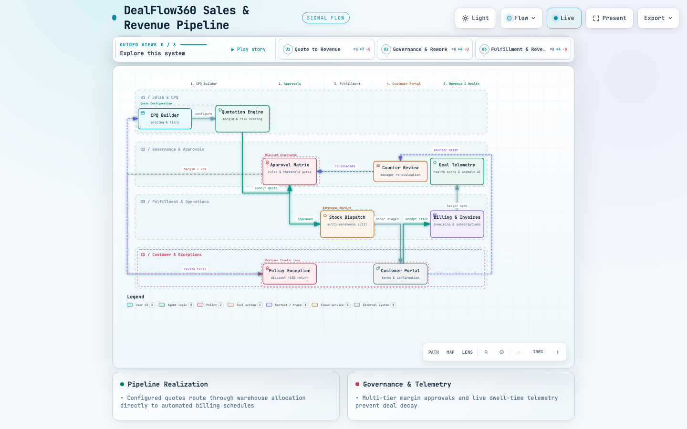
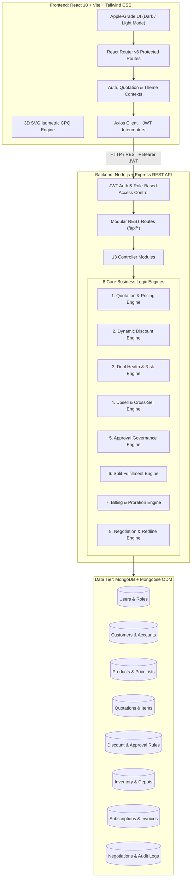

# DealFlow360 — Enterprise CPQ & Deal Lifecycle Operating System

[](https://react.dev/)
[](https://vitejs.dev/)
[](https://nodejs.org/)
[](https://expressjs.com/)
[](https://www.mongodb.com/)
[](https://tailwindcss.com/)
[](https://playwright.dev/)
[](LICENSE)

> **DealFlow360** is an enterprise-grade Configure, Price, Quote (CPQ) and Deal Lifecycle Management platform. It unifies sales quotation generation, dynamic discount governance, AI-driven deal health risk scoring, multi-tier approval chains, split-warehouse order fulfillment, subscription billing with mid-cycle proration, automated invoicing, customer counter-offer negotiation, and executive analytics into a deterministic, single-source-of-truth operating system.

---

## Visual Workflow & Architecture



---

## Table of Contents

1. [Executive Summary & Problem Statement](#1-executive-summary--problem-statement)
2. [High-Level Architecture & Tech Stack](#2-high-level-architecture--tech-stack)
3. [Core Business Engines & Mathematical Formulas](#3-core-business-engines--mathematical-formulas)
   - [3.1 Quotation & Pricing Engine](#31-quotation--pricing-engine)
   - [3.2 Dynamic Discount Engine](#32-dynamic-discount-engine)
   - [3.3 Deal Health & Risk Scoring Engine](#33-deal-health--risk-scoring-engine)
   - [3.4 Upsell & Cross-Sell Recommendation Engine](#34-upsell--cross-sell-recommendation-engine)
   - [3.5 Multi-Tier Approval Governance Engine](#35-multi-tier-approval-governance-engine)
   - [3.6 Warehouse Allocation & Split Fulfillment Engine](#36-warehouse-allocation--split-fulfillment-engine)
   - [3.7 Subscription Billing & Mid-Cycle Proration Engine](#37-subscription-billing--mid-cycle-proration-engine)
   - [3.8 Customer Negotiation & Redline Engine](#38-customer-negotiation--redline-engine)
4. [Master Directory & File Manifest](#4-master-directory--file-manifest)
5. [The Enterprise Screen Directory & Route Mappings](#5-the-enterprise-screen-directory--route-mappings)
6. [Data Tier & Mongoose Models](#6-data-tier--mongoose-models)
7. [Security, Authentication & Role-Based Access Control](#7-security-authentication--role-based-access-control)
8. [REST API Contracts & Endpoints](#8-rest-api-contracts--endpoints)
9. [Installation, Seeding & Development Guide](#9-installation-seeding--development-guide)
10. [Automated Testing & Verification Suites](#10-automated-testing--verification-suites)
11. [Comprehensive Technical & Domain Q&A](#11-comprehensive-technical--domain-qa)

---

## 1. Executive Summary & Problem Statement

In mid-market and enterprise B2B sales organizations, the traditional **Quote-to-Cash (QTC)** cycle suffers from operational friction across fragmented departments:

| Operational Pain Point | Traditional Impact | DealFlow360 Engineered Solution |
| :--- | :--- | :--- |
| **Rogue Discounting** | Sales reps apply ad-hoc discounts in spreadsheets, causing uncontrolled margin erosion. | Deterministic volume discount curves, customer-tier incentives, and hard approval gates capped at a strict 70% maximum. |
| **Approval Bottlenecks** | Quotes stall for days in email threads waiting for sales managers and finance teams to review margin exceptions. | Automated multi-stage approval routing (Manager &rarr; Finance &rarr; Executive/CFO) with real-time SLA tracking. |
| **Fulfillment Disconnects** | Contracts are signed without real-time inventory visibility, resulting in surprise stockouts and shipment delays. | Real-time multi-depot stock reservation and algorithmic split-warehouse order allocation across regional hubs. |
| **Hybrid Billing Friction** | Hybrid quotes (one-time hardware + recurring software + services) lead to invoicing mistakes and missing prorations. | Automated contract bifurcation: generates immediate one-time accounts receivable invoices and recurring subscription schedules with exact proration. |
| **Opaque Negotiations** | Redlines happen over untracked PDFs and phone calls, losing deal velocity and audit trails. | Dedicated Customer Negotiation Portal for line-item redlines, counter-discounts, and automated re-approvals. |

---

## 2. High-Level Architecture & Tech Stack


```mermaid
graph TD
    subgraph Client ["Frontend: React 18 + Vite + Tailwind CSS"]
        UI["Apple-Grade UI (Dark / Light Mode)"]
        Router["React Router v6 Protected Routes"]
        Contexts["Auth, Quotation & Theme Contexts"]
        ClientEngine["3D SVG Isometric CPQ Engine"]
        APIService["Axios Client + JWT Interceptors"]
    end

    subgraph API ["Backend: Node.js + Express REST API"]
        AuthMid["JWT Auth & Role-Based Access Control"]
        Routes["Modular REST Routes (/api/*)"]
        Controllers["13 Controller Modules"]
        
        subgraph Engines ["8 Core Business Logic Engines"]
            E1["1. Quotation & Pricing Engine"]
            E2["2. Dynamic Discount Engine"]
            E3["3. Deal Health & Risk Engine"]
            E4["4. Upsell & Cross-Sell Engine"]
            E5["5. Approval Governance Engine"]
            E6["6. Split Fulfillment Engine"]
            E7["7. Billing & Proration Engine"]
            E8["8. Negotiation & Redline Engine"]
        end
    end

    subgraph Database ["Data Tier: MongoDB + Mongoose ODM"]
        M1[("Users & Roles")]
        M2[("Customers & Accounts")]
        M3[("Products & PriceLists")]
        M4[("Quotations & Items")]
        M5[("Discount & Approval Rules")]
        M6[("Inventory & Depots")]
        M7[("Subscriptions & Invoices")]
        M8[("Negotiations & Audit Logs")]
    end

    UI --> Router --> Contexts --> APIService
    APIService -->|HTTP / REST + Bearer JWT| AuthMid --> Routes --> Controllers
    Controllers --> Engines
    Engines --> Database
```

### Technology Selection Rationale
- **Frontend (React 18 + Vite):** Ultra-fast Hot Module Replacement (<50ms HMR), component-driven architecture, zero Redux bloat via React Context (`AuthContext`, `QuotationContext`, `ThemeContext`), and Tailwind CSS design tokens for fluid dark/light modes.
- **Backend (Node.js + Express):** Event-driven, non-blocking asynchronous I/O ideal for real-time quotation recalculations and microservice calculation loops.
- **Database (MongoDB + Mongoose ODM):** Document-oriented model naturally represents nested, multi-line quotations, line-item discounts, and polymorphic product catalogs without high-latency multi-table joins. Built-in support for in-memory development databases via `mongodb-memory-server`.
- **Security:** Stateless cryptographically signed JWT tokens, Bcrypt password hashing (salt rounds 10), and strict server-side authorization guards preventing unauthorized data mutation or self-approvals.

> **Domain Entity Reference:** See [`docs/domain-model.md`](./docs/domain-model.md) and [`docs/domain-model.png`](./docs/domain-model.png) for full class diagrams and entity relationships.

---

## 3. Core Business Engines & Mathematical Formulas

All core business calculations are centralized in `server/src/services/` to enforce business invariants across both sales rep quotation flows and customer counter-offers.

### 3.1 Quotation & Pricing Engine
Located at `server/src/services/quotation/quotationEngine.js`.
- Hydrates product catalog snapshots using MongoDB IDs.
- Calculates list totals, volume discounts, customer-tier incentives, and custom rep discounts.
- Computes gross profit, line margins, and overall blended margin.
- Evaluates deal health, win probability, and determines whether managerial approval is mandatory.
- Recommends complementary upsell items with predicted revenue impact.

### 3.2 Dynamic Discount Engine
Located at `server/src/services/discount/discountEngine.js`.

$$\text{Effective Discount} = \min\left(70\%,\, \max\left(\text{Rep Custom Discount},\, \text{Volume Discount}(\text{Qty}) + \text{Tier Bonus}\right)\right)$$

- **Volume Step Discount Brackets:**
  - $\ge 100\text{ units}$: **12%**
  - $50 - 99\text{ units}$: **8%**
  - $20 - 49\text{ units}$: **5%**
  - $10 - 19\text{ units}$: **3%**
  - $< 10\text{ units}$: **0%**
- **Customer Account Tier Bonus:**
  - `Enterprise`: **+5%** automatic incentive
  - `Mid-Market`: **+2%** automatic incentive
  - `SMB`: **+0%** (standard volume brackets)
- **Margin Calculations:**
  - $\text{Line Margin Amount} = \text{Net Line Total} - (\text{Unit Cost} \times \text{Quantity})$
  - $\text{Line Margin \%} = \left(\frac{\text{Line Margin Amount}}{\text{Net Line Total}}\right) \times 100$
  - $\text{Blended Margin \%} = \left(\frac{\text{Grand Total} - \text{Total Cost}}{\text{Grand Total}}\right) \times 100$
- **Hard Safety Ceiling:** Enforces an unbreachable **70% discount cap** regardless of combined inputs.

### 3.3 Deal Health & Risk Scoring Engine
Located at `server/src/services/dealHealth/dealHealthEngine.js`.

$$\text{Risk Score} = \text{clamp}\Big(10 + \Delta_{\text{margin}} + \Delta_{\text{discount}} + \Delta_{\text{credit}} + \Delta_{\text{size}},\, 5,\, 100\Big)$$

Where factor adjustments are defined as:
- **Margin Delta ($\Delta_{\text{margin}}$):** $+40$ (margin $< 15\%$), $+25$ (margin $< 25\%$), $+10$ (margin $< 35\%$)
- **Discount Delta ($\Delta_{\text{discount}}$):** $+30$ (average discount $> 30\%$), $+15$ (average discount $> 20\%$)
- **Credit Rating Delta ($\Delta_{\text{credit}}$):** $+25$ (credit rating `B` or `BB`), $+10$ (credit rating `BBB`)
- **Deal Size Exposure ($\Delta_{\text{size}}$):** $+10$ (deal total $> \$250,000$)
- **Win Probability:** Calculated between $20\%$ and $95\%$ based on pricing competitiveness and customer trust index.

### 3.4 Upsell & Cross-Sell Recommendation Engine
Located at `server/src/services/upsell/upsellEngine.js`.
- Evaluates line items present in the quotation cart in real time.
- Identifies critical architectural or support gaps (e.g., enterprise hardware without onboarding services, or software seats lacking 24/7 SLA coverage).
- Surfaces 1-click addable products with instant revenue and margin impact previews.

### 3.5 Multi-Tier Approval Governance Engine
Located at `server/src/services/approval/approvalEngine.js`.
- **Governance Gate Thresholds:**
  - **Tier 1 (Sales Manager):** Rep discount $> 15\%$ OR total quote value $> \$50,000$.
  - **Tier 2 (Finance Manager):** Rep discount $> 25\%$ OR blended margin $< 20\%$.
  - **Tier 3 (Executive / CFO):** Rep discount $> 35\%$, blended margin $< 10\%$, OR total deal $> \$250,000$.
- **Strict Role Separation:** Rep self-approvals are rejected server-side with HTTP 403/400 even if permissions are spoofed.

### 3.6 Warehouse Allocation & Split Fulfillment Engine
Located at `server/src/services/fulfillment/fulfillmentEngine.js`.
- Inspects real-time inventory levels across all distribution hubs (`Main Hub`, `West Coast Depot`, `East Coast Depot`).
- Automatically splits line-item quantities across secondary depots if the primary warehouse lacks on-hand stock.
- Executes atomic inventory reservation using MongoDB `$inc: { quantityReserved: qty }` to prevent stock race conditions.
- Generates automated backorder alerts for unallocated inventory shortfalls.

### 3.7 Subscription Billing & Mid-Cycle Proration Engine
Located at `server/src/services/billing/billingEngine.js`.
- Bifurcates approved deals automatically:
  - **One-Time Line Items:** Generates immediate standard accounts receivable invoices.
  - **Recurring Software Seats:** Creates ongoing `Subscription` contracts (`monthly`, `annual`).
- **Mid-Cycle Upgrade Proration Formula:**

$$\text{Proration Amount} = \left(\frac{\text{Days Remaining in Billing Cycle}}{\text{Total Days in Billing Cycle}}\right) \times (\text{New Plan Rate} - \text{Old Plan Rate})$$

### 3.8 Customer Negotiation & Redline Engine
Located at `server/src/services/negotiation/negotiationEngine.js`.
- Allows external buyers in the Customer Portal to propose target line-item discounts, revised quantities, or delivery terms.
- Recalculates margins and risk scores server-side.
- If counter-offers breach standard thresholds, the deal automatically re-enters the managerial approval queue.

---

## 4. Master Directory & File Manifest

```
dealFLow360/
├── client/                               # Single-Page Application (React 18 + Vite)
│   ├── src/
│   │   ├── components/
│   │   │   ├── approval/                # ApprovalTimeline, ActionModal, RiskBadge
│   │   │   ├── auth/                    # IsometricIllustration (3D CPQ Engine SVG)
│   │   │   ├── billing/                 # ProrationBreakdown, InvoiceCard
│   │   │   ├── common/                  # Button, Card, Badge, Input, Modal, Select
│   │   │   ├── dashboard/               # MetricCard, PipelineChart
│   │   │   ├── fulfillment/             # WarehouseAllocationTable, BackorderAlert
│   │   │   ├── layout/                  # AppLayout, Navbar, Sidebar
│   │   │   ├── quotation/               # QuotationItemsTable, DiscountSummary, BlendedRiskCard, UpsellPanel
│   │   │   └── tables/                  # DataTable, Pagination
│   │   ├── context/                     # AuthContext, QuotationContext, ThemeContext
│   │   ├── hooks/                       # useAuth, useDebounce
│   │   ├── pages/
│   │   │   ├── admin/                   # DiscountTiersSetupPage, SalesBackendConfigurationPage
│   │   │   ├── approvals/               # ApprovalsQueuePage, ApprovalDetailsPage
│   │   │   ├── auth/                    # LoginPage (3D CPQ Engine & 1-Click Personas)
│   │   │   ├── billing/                 # InvoicesPage, InvoiceDetailsPage, BillingDetailPage
│   │   │   ├── customer/                # CustomerPortalPage (Negotiation & Redlines)
│   │   │   ├── dashboard/               # DashboardPage (Executive Cockpit)
│   │   │   ├── dealHealth/              # DealHealthPage (Pipeline Risk Matrix)
│   │   │   ├── fulfillment/             # FulfillmentPage, FulfillmentDetailPage
│   │   │   ├── products/                # ProductCatalogPage, ProductDetailsPage
│   │   │   ├── quotations/              # QuotationsListPage, QuotationBuilderPage, NegotiationsPage
│   │   │   ├── reports/                 # AdminReportingPage (BI League Tables)
│   │   │   └── subscriptions/           # SubscriptionsPage (MRR / ARR Management)
│   │   ├── routes/                      # AppRoutes, ProtectedRoute
│   │   └── services/                    # Axios API Services (quotationService, authService, etc.)
├── server/                               # Node.js + Express REST API Backend
│   ├── src/
│   │   ├── config/                      # db.js (MongoDB / In-Memory), constants.js (Enums)
│   │   ├── controllers/                 # 13 Controllers (quotation, approval, billing, negotiation, etc.)
│   │   ├── middleware/                  # authMiddleware, errorHandler
│   │   ├── models/                      # 12 Mongoose Models (User, Quotation, Product, Invoice, etc.)
│   │   ├── routes/                      # 12 REST Route Modules mounted at /api/*
│   │   ├── seed/                        # Comprehensive database seeder (seed.js)
│   │   ├── services/                    # 8 Business Logic Engines
│   │   └── utils/                       # apiResponse, accessControl, decimal precision helpers
├── docs/                                 # Architectural specifications, domain models, visual diagrams
├── package.json                          # Monorepo runner (concurrently runs client + server)
└── README.md                             # Primary technical documentation & manual
```

---

## 5. The Enterprise Screen Directory & Route Mappings

| Screen | Page Component | Route | Access Roles | Key Capabilities |
| :---: | :--- | :--- | :--- | :--- |
| **1** | `LoginPage.jsx` | `/login` | Public | Authentication, 3D interactive isometric CPQ engine, 1-click test persona quick switcher, magic links. |
| **2** | `DashboardPage.jsx` | `/dashboard` | Authenticated | Executive cockpit: active pipeline MRR, approval counts, margin velocity, win rates, quick actions. |
| **3** | `QuotationsListPage.jsx` | `/quotations` | Rep, Manager, Admin | Searchable quotes table, status filtering, date range sorting, and margin risk indicators. |
| **4** | `QuotationsListPage.jsx` | `/pipeline` | Rep, Manager, Admin | Interactive **Kanban Deal Pipeline** organized by quotation lifecycle stages. |
| **5** | `QuotationBuilderPage.jsx`| `/quotations/new`, `/quotations/builder` | Rep, Manager, Admin | Interactive CPQ builder with live 250ms debounced calculations, volume discounts, and dynamic upsells. |
| **6** | `QuotationDetailsPage.jsx`| `/quotations/:id` | Rep, Manager, Admin | Detailed quotation inspection, line-item margins, customer terms, and print-ready PDF export. |
| **7** | `NegotiationsPage.jsx` | `/negotiations` | Rep, Manager, Admin | Sales rep hub for reviewing customer redlines, counter-discount proposals, and concession logs. |
| **Portal** | `CustomerPortalPage.jsx` | `/portal`, `/customer/dashboard` | Customer, Admin | Dedicated external buyer portal: view quotes, submit target counter-discounts, line redlines, and accept. |
| **8** | `ApprovalsQueuePage.jsx` | `/approvals` | Manager, Finance, Admin | Prioritized managerial review queue sorted by discount depth, margin erosion, and SLA urgency. |
| **9** | `ApprovalDetailsPage.jsx` | `/approvals/:id` | Manager, Finance, Admin | Line-by-line violation audit, 3-stage stepper, and Approve / Return for Revision / Reject actions. |
| **10** | `FulfillmentPage.jsx` | `/fulfillment` | Operations, Finance, Admin | Multi-depot logistics dashboard: on-hand stock, backorders, and allocation health. |
| **11** | `FulfillmentDetailPage.jsx`| `/fulfillment/:id` | Operations, Finance, Admin | Multi-depot split execution: allocates partial line-item quantities across Main and Regional hubs. |
| **12** | `SubscriptionsPage.jsx` | `/subscriptions` | Finance, Admin | Recurring revenue management: Active/Paused/Cancelled contracts, MRR/ARR gauges, and renewal tracking. |
| **13** | `BillingDetailPage.jsx` | `/subscriptions/:id`, `/billing/:id` | Finance, Admin | Contract deep-dive: mid-cycle upgrades, seat count changes, and itemized proration schedules. |
| **14** | `InvoicesPage.jsx` | `/invoices`, `/billing` | Finance, Admin | Accounts receivable ledger tracking one-time hardware and recurring invoices, taxes, and aging. |
| **15** | `InvoiceDetailsPage.jsx` | `/invoices/:id` | Finance, Admin, Customer | Order-to-cash lifecycle tracker (Confirmed &rarr; Shipped &rarr; Invoiced &rarr; Paid) and settlement modal. |
| **16** | `DealHealthPage.jsx` | `/deal-health` | Manager, Admin | Pipeline risk matrix: flags stalled quotes (> 7 days), margin anomalies, and automated rep nudges. |
| **17** | `AdminReportingPage.jsx` | `/reports` | Admin | Executive BI reporting: sales rep league tables, average discount trends, and approval cycle times. |
| **18** | `ProductCatalogPage.jsx` | `/products` | Admin | Master SKU catalog: search, category filters (Hardware, Software, Cloud, Services), and tax settings. |
| **19** | `ProductDetailsPage.jsx` | `/products/:id`, `/products/new` | Admin | SKU configuration: base list price, unit cost, billing frequency, and tier price list rules. |
| **20** | `DiscountTiersSetupPage.jsx`| `/discount-tiers`, `/admin/discount-chains` | Manager, Admin | Governance configuration: discount caps per tier, volume bracket curves, and approval trigger rules. |
| **Hub** | `SalesBackendConfigurationPage.jsx` | `/backend-config`, `/admin/setup` | Admin | Unified Administration Hub covering configuration areas A1 through A7. |

---

## 6. Data Tier & Mongoose Models

1. **User (`User.js`):** `name`, `email`, `passwordHash` (bcrypt), `role` (`sales_rep`, `sales_manager`, `finance`, `admin`, `customer`), `department`, `isActive`.
2. **Customer (`Customer.js`):** `name`, `email`, `tier` (`Enterprise`, `Mid-Market`, `SMB`), `creditRating` (`AAA` through `B`), `paymentTerms` (`Net 15`, `Net 30`, `Net 60`), `assignedRepId`.
3. **Product (`Product.js`):** `sku`, `name`, `category` (`Software`, `Hardware`, `Cloud`, `Services`, `Support`), `basePrice`, `unitCost`, `billingType` (`one_time`, `recurring_monthly`, `recurring_annual`), `isAddon`.
4. **Quotation (`Quotation.js`):** `quoteNumber` (`QT-YYYY-XXXX`), `customerId`, `salesRepId`, `status` (`draft`, `pending_approval`, `approved`, `sent_to_customer`, `accepted`), `items[]` (quantity, listPrice, customDiscountPercent, netPrice, marginPercent), `grossSubtotal`, `totalDiscountAmount`, `netTotal`, `blendedMarginPercent`, `riskScore`, `requiresApproval`.
5. **ApprovalRequest (`ApprovalRequest.js`):** `quotationId`, `submitterId`, `currentLevel`, `stages[]` (`approverRole`, `status`, `decisionNote`, `decidedAt`), `slaExpiresAt`.
6. **Inventory (`Inventory.js`):** `productId`, `warehouseLocation` (`Main Hub`, `West Coast Depot`, `East Coast Depot`), `onHand`, `reserved`, `available`.
7. **Subscription (`Subscription.js`):** `quotationId`, `customerId`, `planName`, `billingCycle` (`monthly`, `annual`), `mrr`, `status` (`active`, `paused`, `cancelled`), `renewsAt`.
8. **Invoice (`Invoice.js`):** `invoiceNumber`, `quotationId`, `customerId`, `type` (`one_time`, `subscription`), `amount`, `taxAmount`, `totalAmount`, `status` (`unpaid`, `paid`, `overdue`), `dueDate`.
9. **Negotiation (`Negotiation.js`):** `quotationId`, `customerId`, `counterOffers[]` (proposedDiscounts, redlines, comments, submittedAt), `status` (`open`, `accepted`, `escalated`).

---

## 7. Security, Authentication & Role-Based Access Control

DealFlow360 implements strict defense-in-depth across authentication and API routing:

1. **Stateless JWT Authorization:** Client sends credentials to `/api/auth/login`. On verification, the server issues a cryptographically signed JWT. Subsequent requests pass `Authorization: Bearer <token>`, intercepted by Axios.
2. **Server-Enforced RBAC & Resource Ownership:** Route handlers verify that sales reps can only edit their own draft quotations (`quotation.createdBy === req.user._id`), and buyers can only access quotes assigned to their organization (`quotation.customer === req.user.customerId`).
3. **Self-Approval Prevention:** The backend strictly forbids quote creators from approving their own deals, even if their account holds managerial or administrative credentials.
4. **Interactive 1-Click Demo Personas:** The login screen provides instant role-switching personas with pre-seeded data:

| Persona | Role | Email | Password | Primary Scope |
| :--- | :--- | :--- | :--- | :--- |
| **Alex Rivera** | Sales Rep | `alex@dealflow360.com` | `password123` | Quote Builder, CPQ Upsells, Kanban Pipeline |
| **Sarah Vance** | Sales Manager | `sarah@dealflow360.com` | `password123` | Tier 1 Approvals, Discount Tiers, Deal Health |
| **David Sterling** | Finance / Ops | `finance@dealflow360.com` | `password123` | Tier 2 Approvals, Split Depot Fulfillment, Invoices |
| **Marcus Chen** | Admin | `admin@dealflow360.com` | `password123` | Catalog, System Config Hub, BI Reports |
| **Acme Buyer** | Customer Portal | `procurement@acme.com` | *(Magic Link / One-Click)* | Buyer Negotiation Portal, Redlines, Contract Acceptance |

---

## 8. REST API Contracts & Endpoints

| Method | Endpoint | Description | Permitted Roles |
| :--- | :--- | :--- | :--- |
| `POST` | `/api/auth/login` | Authenticate credentials and receive signed JWT. | Public |
| `GET` | `/api/auth/me` | Fetch active user profile from session token. | Authenticated |
| `POST` | `/api/quotations/preview` | Real-time calculation of pricing, volume discounts, margins, and upsells. | Rep, Manager, Admin |
| `GET` | `/api/quotations` | List quotations with search, stage, and customer filters. | Authenticated |
| `POST` | `/api/quotations` | Create and persist a new quotation. | Rep, Manager, Admin |
| `GET` | `/api/quotations/:id` | Fetch complete quotation record with populated relational documents. | Authenticated |
| `PATCH`| `/api/quotations/:id/status` | Advance quote lifecycle (submit for approval, mark sent, accept). | Authenticated |
| `GET` | `/api/approvals` | Retrieve pending approval queue with SLA timers. | Manager, Finance, Admin |
| `POST` | `/api/approvals/:id/decision`| Record managerial decision (`approve`, `return`, `reject`). | Manager, Finance, Admin |
| `GET` | `/api/fulfillment` | List warehouse stock allocations and backorder alerts. | Authenticated |
| `POST` | `/api/fulfillment/:id/split` | Execute multi-depot inventory split allocation. | Operations, Admin |
| `GET` | `/api/billing/subscriptions` | List recurring subscription contracts and ARR metrics. | Finance, Admin |
| `POST` | `/api/billing/proration` | Compute itemized mid-cycle plan upgrade proration. | Finance, Admin |
| `GET` | `/api/billing/invoices` | Accounts receivable ledger with payment status. | Authenticated |
| `POST` | `/api/billing/invoices/:id/pay`| Process invoice settlement and record payment. | Finance, Customer, Admin |
| `POST` | `/api/negotiation/:id/counter` | Submit buyer counter-proposal with automatic threshold re-check. | Customer, Rep, Admin |

---

## 9. Installation, Seeding & Development Guide

### Prerequisites
- **Node.js** >= 18.0.0
- **npm** >= 9.0.0
- **MongoDB** running locally on `mongodb://127.0.0.1:27017` *(optional: system will automatically launch an in-memory database via `mongodb-memory-server` if `MONGODB_URI` is not set)*

### 1. Installation
Install all root, client, and server dependencies in a single command:
```bash
git clone https://github.com/hack704/dealFLow360.git
cd dealFLow360
npm run install:all
```

### 2. Clean Port Conflicts (Optional)
If ports 5000 or 5173 are held by prior processes:
```bash
npm run clean:ports
```

### 3. Launch Development Environment
Run both backend Express API and frontend Vite SPA concurrently:
```bash
npm run dev
```

- **Client Application:** [http://localhost:5173](http://localhost:5173)
- **Express Backend API:** [http://localhost:5000](http://localhost:5000)
- **API Health Heartbeat:** [http://localhost:5000/api/health](http://localhost:5000/api/health)

### 4. Database Seeding
The backend automatically checks and seeds a full suite of default users, customers, products, and quotations on its first startup. To trigger a clean re-seed manually:
```bash
npm run seed --prefix server
```

### 5. Production Build
```bash
npm run build --prefix client
```

---

## 10. Automated Testing & Verification Suites

The repository contains comprehensive automated test suites verifying end-to-end operational flows, dynamic pricing recalculations, and RBAC security:

```bash
# 1. Full-pipeline end-to-end test (Quote creation -> Approval -> Split fulfillment -> Billing)
node test_pipeline_e2e.js

# 2. Dynamic multi-module test (Validates reactive CPQ calculations across all routes)
node test_all_modules_dynamic.js

# 3. Security and RBAC audit (Verifies route guards, ownership checks, and self-approval block)
node test_admin_auth_audit.js

# 4. Subscription lifecycle test (Validates pause, return, and mid-cycle proration)
node test_subscription_pause_and_return.js

# 5. Playwright web app automated route crawler
python3 test_webapp_all_routes.py
```

---

## 11. Comprehensive Technical & Domain Q&A

### Category 1: Business Domain & Strategic Value
#### Q1: What core business problem does DealFlow360 solve?
**A:** DealFlow360 eliminates the operational friction and revenue leakage in enterprise Quote-to-Cash (QTC). Without automated CPQ governance, sales teams calculate quotes in ad-hoc spreadsheets with unapproved discounts, degrading corporate margins. Concurrently, manual email approvals cause multi-day delays, warehouse stock is verified only after contracts are signed (leading to backorders), and hybrid recurring software models suffer from billing inaccuracies. DealFlow360 binds these fragmented steps into a deterministic, single-source-of-truth operating system.

#### Q2: What is the difference between a traditional CRM and a CPQ operating system?
**A:** A CRM tracks sales pipeline stages, activities, and contact records. A CPQ (Configure, Price, Quote) system enforces strict mathematical and commercial logic: it validates product compatibility, calculates dynamic pricing and tiered volume discounts, enforces margin thresholds, triggers multi-tier approval chains, and automates multi-depot split fulfillment and recurring subscription billing.

#### Q3: What customer tiers are supported, and how do they impact pricing?
**A:** Three customer account tiers are configured:
- `Enterprise`: Receives an automatic +5% commercial incentive discount and prioritized warehouse allocation.
- `Mid-Market`: Receives an automatic +2% commercial incentive discount.
- `SMB`: Base volume discount brackets apply with standard fulfillment priority.

---

### Category 2: Technical Architecture & Design Rationale
#### Q4: Why was React 18 + Vite selected for the frontend instead of Next.js?
**A:** DealFlow360 is an authenticated enterprise intranet tool (an operational cockpit), not a public-facing marketing website that requires Server-Side Rendering (SSR) for search engine indexing. Vite provides sub-50ms Hot Module Replacement (HMR) and lean static production bundles, maximizing developer productivity and runtime responsiveness for state-heavy single-page applications.

#### Q5: How is state managed across the frontend without Redux?
**A:** State is organized using domain-focused React Context providers:
- `AuthContext`: Manages JWT sessions, user permissions, and persistent login tokens.
- `QuotationContext`: Central CPQ state machine managing cart line items, discounts, and real-time calculation previews.
- `ThemeContext`: Toggles dark/light modes and synchronizes with system color preferences.
Combining Context with custom hooks (`useDebounce`) eliminates boilerplate while delivering fluid 60 FPS interactions.

#### Q6: Why is MongoDB / Mongoose used instead of a relational SQL database?
**A:** Quotations are inherently hierarchical and snapshot-oriented documents. A single quote contains nested arrays of line items, individual discount overrides, and product price snapshots (preserving list prices at the exact moment of quote generation even if master catalog prices change later). MongoDB stores these nested documents atomically without complex multi-table joins.

---

### Category 3: CPQ Calculation & Pricing Mechanics
#### Q7: How does the dynamic volume discount formula work?
**A:** Volume discounting follows a progressive step curve:
- $\ge 100\text{ units}$: 12%
- $50 - 99\text{ units}$: 8%
- $20 - 49\text{ units}$: 5%
- $10 - 19\text{ units}$: 3%
- $< 10\text{ units}$: 0%
The effective discount combines volume discounts and account tier bonuses, while respecting any custom rep discount, capped at a safety limit of 70%.

#### Q8: How does DealFlow360 prevent UI lag during rapid slider adjustments?
**A:** In `QuotationContext.jsx`, a 250ms debounced hook (`useDebounce.js`) buffers input changes. When a sales rep rapidly adjusts quantities or discount sliders, local UI state updates immediately, while the backend recalculation request (`POST /api/quotations/preview`) fires only after user input pauses for 250ms.

#### Q9: What happens if an unauthorized client enters an excessive discount (e.g. 95%)?
**A:** The backend `discountEngine.js` enforces a strict mathematical clamp:
$$\text{Effective Discount} = \min(70\%,\, \text{Input Discount})$$
Even if a client attempts to bypass frontend controls, the server refuses discounts above 70% and marks the quote with a Critical Risk rating requiring Executive CFO approval.

---

### Category 4: Multi-Tier Approvals & Governance
#### Q10: What are the three approval tiers and their thresholds?
**A:**
- **Tier 1 (Sales Manager):** Required when any line-item discount exceeds 15% OR total quote value exceeds $50,000.
- **Tier 2 (Finance Manager):** Required when discount exceeds 25% OR blended margin drops below 20%.
- **Tier 3 (Executive / CFO):** Required when discount exceeds 35%, blended margin drops below 10%, OR total deal exceeds $250,000.

#### Q11: Can a sales rep approve their own quotation?
**A:** No. Self-approval is strictly forbidden and blocked by server-side invariants. If a quote creator attempts to submit an approval action on their own deal, the backend rejects the transaction with an HTTP 403/400 integrity violation error.

---

### Category 5: Multi-Warehouse Split Fulfillment
#### Q12: How does DealFlow360 prevent inventory stockouts and overselling?
**A:** When a quote is approved, `fulfillmentEngine.js` verifies real-time stock levels across all distribution hubs (`Main Hub`, `West Coast Depot`, `East Coast Depot`). If the primary warehouse has insufficient on-hand stock, it automatically splits line items into multi-depot shipments and creates backorder alerts for unallocated balances. All reservations use atomic MongoDB `$inc` operations to eliminate race conditions.

---

### Category 6: Subscription Billing & Mid-Cycle Proration
#### Q13: How does DealFlow360 handle hybrid deals with both hardware and software?
**A:** In `billingEngine.js`, the system bifurcates the quote:
- **One-Time Line Items:** (e.g., servers, installation fees) generate an immediate standard accounts receivable Invoice.
- **Recurring Line Items:** (e.g., SaaS software licenses) instantiate a recurring `Subscription` contract with assigned billing cadences (`monthly`, `annual`).

#### Q14: How is mid-cycle subscription proration calculated?
**A:** When a customer upgrades their recurring plan mid-cycle (e.g., expanding from 10 to 25 seats 10 days into a 30-day month):
$$\text{Proration Amount} = \left(\frac{\text{Days Remaining}}{\text{Total Days in Cycle}}\right) \times (\text{New Monthly Rate} - \text{Old Monthly Rate})$$
The engine computes the pro-rated difference and immediately issues an incremental adjustment invoice.

---

*DealFlow360 Operating System — Engineered for Enterprise Precision.*
