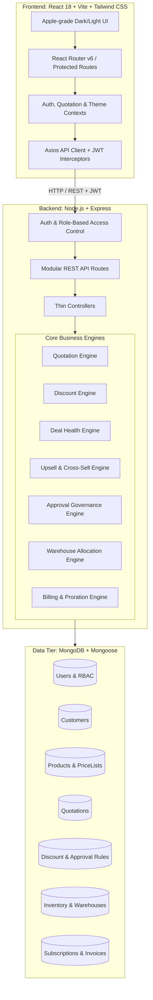
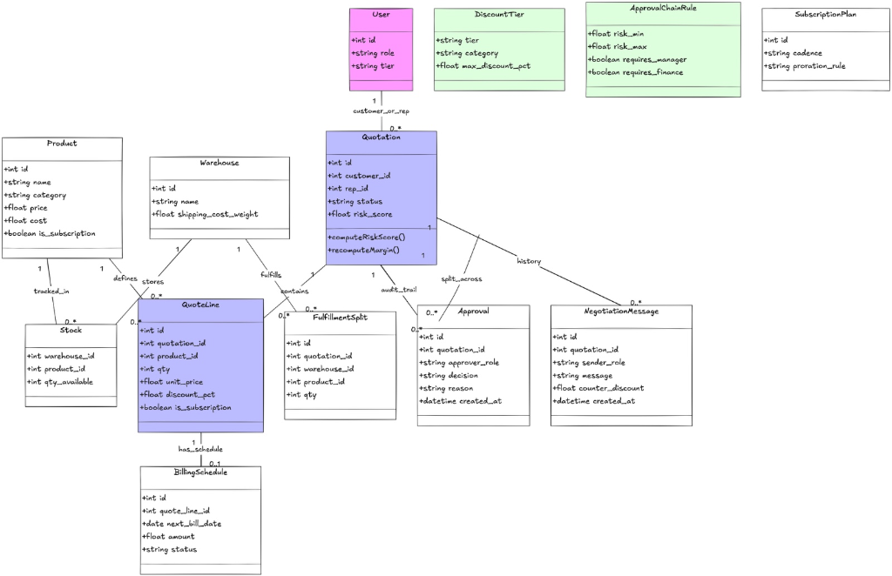

# DealFlow360 — Comprehensive Technical Architecture & Manifest

> **System Overview:** DealFlow360 is an enterprise-grade CPQ (Configure, Price, Quote) and Deal Lifecycle Management Operating System. It unifies sales quotation generation, dynamic discount governance, AI-driven deal health risk scoring, multi-tier approval chains, split-warehouse order fulfillment, subscription billing with mid-cycle proration, automated invoicing, customer counter-offer negotiation, and executive analytics into a cohesive platform.

---

## 1. Why DealFlow360 Exists: The Problem Space

In mid-market and enterprise B2B sales organizations, the "Quote-to-Cash" cycle is notoriously fragmented:
1. **Rogue Discounting & Margin Erosion:** Sales reps apply ad-hoc discounts in spreadsheets without visibility into blended margins, product cost structures, or customer creditworthiness.
2. **Approval Bottlenecks:** Deals languish in email threads waiting for sales managers and finance leaders to manually review exceptions.
3. **Fulfillment Disconnects:** Quotes are signed without real-time inventory checks, causing unmanaged stockouts and multi-warehouse logistics delays.
4. **Billing Complexity:** Hybrid business models (one-time hardware/setup fees combined with recurring software subscriptions and usage tiers) lead to billing errors, missing prorations, and delayed revenue recognition.
5. **Opaque Customer Negotiations:** Redlines and counter-proposals happen across untracked phone calls and PDF edits, obscuring deal velocity and audit trails.

**DealFlow360 solves this by acting as a single source of truth**, linking product catalogs, pricing rules, approval matrices, inventory distribution, billing schedules, and customer negotiation into an automated, deterministic pipeline.

---

## 2. End-to-End Architecture & Tech Stack

### 2.1 Technology Stack Choices & Rationale
- **Frontend:** React 18, Vite (sub-second HMR), Tailwind CSS (consistent design token system with dark/light mode support), Lucide React (standardized iconography), Axios (interceptor-based JWT auth lifecycle).
- **Backend:** Node.js + Express.js (non-blocking I/O suited for event-driven quote processing), Mongoose ODM (schema validation, indexing, and object modeling for complex nested quotation items).
- **Security:** Bcrypt password hashing (salt factor 10), stateless JWT tokens with role-based authorization middleware (`sales_rep`, `sales_manager`, `finance`, `admin`, `customer`).

### 2.2 Domain Class Diagram & Entity Relationships

See detailed reference in [`docs/domain-model.md`](./domain-model.md).

---

## 3. Directory & File Manifest: Why Everything Exists

### 3.1 Root Level

| File / Folder | Purpose & Architectural Rationale |
| :--- | :--- |
| [`package.json`](file:///Users/braj/dealFLow360/package.json) | Root monorepo orchestration file. Uses `concurrently` to run both client and server development servers simultaneously via `npm run dev`. |
| [`package-lock.json`](file:///Users/braj/dealFLow360/package-lock.json) | Deterministic dependency tree lock for root-level developer tools. |
| [`.gitignore`](file:///Users/braj/dealFLow360/.gitignore) | Prevents committing `node_modules`, environment files (`.env`), build artifacts (`dist/`, `build/`), logs, and operating system metadata (`.DS_Store`). |
| [`README.md`](file:///Users/braj/dealFLow360/README.md) | Primary project introduction and quickstart guide for engineers. |
| [`docs/`](file:///Users/braj/dealFLow360/docs) | Architectural schematics, technical documentation, entity relationships, and API contract specifications. |
| [`client/`](file:///Users/braj/dealFLow360/client) | Complete single-page application (SPA) frontend containing all user-facing interfaces and wireframe screens. |
| [`server/`](file:///Users/braj/dealFLow360/server) | REST API microservice housing business logic engines, database models, controllers, and authorization layers. |

---

### 3.2 Server Architecture (`server/`)

#### Configuration & Initialization (`server/src/config/`, `server/src/server.js`, `server/src/app.js`)
- [`server/src/server.js`](file:///Users/braj/dealFLow360/server/src/server.js): Server entry point. Establishes the database connection via `connectDB()`, verifies whether the database requires seeding (auto-seeds default enterprise dataset on first boot), and binds Express to the designated network port.
- [`server/src/app.js`](file:///Users/braj/dealFLow360/server/src/app.js): Application setup. Attaches global middleware (`cors`, `express.json()`, `express.urlencoded()`), exposes a `/api/health` heartbeat route, mounts `/api` routes, and registers the centralized error-handling middleware.
- [`server/src/config/db.js`](file:///Users/braj/dealFLow360/server/src/config/db.js): Manages resilient MongoDB connection lifecycle with graceful disconnect handling and environment fallback (`mongodb://127.0.0.1:27017/dealflow360`).
- [`server/src/config/constants.js`](file:///Users/braj/dealFLow360/server/src/config/constants.js): Single source of truth for domain enums:
  - `ROLES`: `sales_rep`, `sales_manager`, `finance`, `customer`, `admin`.
  - `QUOTATION_STATUSES`: `draft`, `pending_approval`, `approved`, `rejected`, `sent_to_customer`, `accepted`, `expired`.
  - `DEAL_STAGES`: `qualification`, `proposal_development`, `internal_approval`, `negotiation`, `closed_won`, `closed_lost`.
  - `PRICING_TYPES`: `one_time`, `recurring_monthly`, `recurring_annual`, `usage_based`.
  - `RISK_LEVELS`: `low`, `moderate`, `high`, `critical`.
  - `APPROVAL_THRESHOLDS`: Rep discount ceiling (15%), Manager discount ceiling (25%), Minimum acceptable margin (20%).

#### Database Models (`server/src/models/`)
Each model maps to a core enterprise entity in the deal lifecycle:
- [`User.js`](file:///Users/braj/dealFLow360/server/src/models/User.js): User identities with role-based access control, hashed passwords (bcrypt), and department metadata.
- [`Customer.js`](file:///Users/braj/dealFLow360/server/src/models/Customer.js): B2B accounts storing industry, tier (`Enterprise`, `Mid-Market`, `SMB`), credit rating (`AAA` to `B`), annual revenue, and negotiated payment terms.
- [`Product.js`](file:///Users/braj/dealFLow360/server/src/models/Product.js): Master product catalog storing SKU, category (Software, Hardware, Cloud, Professional Services, Support), base price, unit cost, addon flags, and suggested product associations.
- [`Quotation.js`](file:///Users/braj/dealFLow360/server/src/models/Quotation.js): Master deal record storing line items with quantities, list prices, custom and volume discounts, net prices, margin calculations, blended risk scores, approval flags, and status lifecycle.
- [`DiscountRule.js`](file:///Users/braj/dealFLow360/server/src/models/DiscountRule.js): Volume discount brackets and maximum rep discount allowances before managerial approval triggers.
- `ApprovalRequest.js` & `ApprovalRule.js`: Multi-level approval chains capturing submitter, required approval stages (Manager, Finance, Executive), escalation notes, and audit timestamps.
- `Inventory.js`: Multi-warehouse stock tracking (units on hand, reserved units, warehouse locations: Main, East, West) to support order splits.
- `Subscription.js`: Recurring billing contracts tracking billing cycles (Monthly, Quarterly, Annual), MRR/ARR, renewal dates, and status (`Active`, `Paused`, `Cancelled`).
- `Invoice.js`: Accounts receivable records tracking one-time and recurring invoices, tax calculations, payment status (`Unpaid`, `Paid`), and due dates.
- `Negotiation.js`: Customer counter-proposals, line-item redlines, discount change requests, and client commentary.
- `DealHealth.js`: Historical deal health metrics, margin velocity, and churn risk parameters.
- `PriceList.js`: Multi-currency and account-tier specific pricing overrides (Bronze, Gold, Enterprise Partner).

#### Business Logic Engines (`server/src/services/`)
Separating business logic from controllers guarantees modularity and testability:
- [`quotation/quotationEngine.js`](file:///Users/braj/dealFLow360/server/src/services/quotation/quotationEngine.js): Central CPQ orchestrator. Hydrates product information from IDs, executes discount and margin computations, invokes deal health risk analysis, generates smart upsells, and evaluates approval necessity.
- [`discount/discountEngine.js`](file:///Users/braj/dealFLow360/server/src/services/discount/discountEngine.js):
  - Calculates dynamic volume discounts: $\ge 100 \implies 12\%$, $\ge 50 \implies 8\%$, $\ge 20 \implies 5\%$, $\ge 10 \implies 3\%$.
  - Injects customer tier bonuses: Enterprise $+5\%$, Mid-Market $+2\%$.
  - Reconciles rep custom discounts vs system allowances (safety capped at $70\%$).
  - Calculates line-by-line and blended margins.
  - Automatically raises approval flags when discounts exceed $15\%$ or margins drop below $20\%$.
- [`dealHealth/dealHealthEngine.js`](file:///Users/braj/dealFLow360/server/src/services/dealHealth/dealHealthEngine.js): Evaluates composite deal risk score ($0 - 100$) across 4 vectors:
  1. *Margin Erosion:* Blended margin $<15\%$ ($+40$ risk), $<25\%$ ($+25$ risk).
  2. *Deep Discounting:* Aggregate discount $>30\%$ ($+30$ risk), $>20\%$ ($+15$ risk).
  3. *Customer Credit Rating:* Credit rating B/BB ($+25$ risk), BBB ($+10$ risk).
  4. *Financial Exposure:* Total value $>\$250,000$ ($+10$ risk).
  - Also computes projected win probability ($20\% - 95\%$) based on pricing attractiveness and account tier.
- [`upsell/upsellEngine.js`](file:///Users/braj/dealFLow360/server/src/services/upsell/upsellEngine.js): Recommends high-margin complementary addons (VIP 24/7 SLA, Professional Onboarding, High-Availability Cloud) with estimated revenue lift and rationale.
- `approval/approvalEngine.js`: Multi-step routing engine directing exceptions through sequential approvers (Sales Manager $\to$ Finance $\to$ VP/CFO).
- `fulfillment/fulfillmentEngine.js`: Optimizes warehouse order splits based on geographic proximity and real-time stock levels.
- `billing/billingEngine.js`: Calculates mid-cycle subscription proration:
  $$\text{Proration} = \frac{\text{Days Remaining in Cycle}}{\text{Total Days in Cycle}} \times \Delta \text{Plan Value}$$
- `negotiation/negotiationEngine.js`: Handles negotiation state transitions and flags counter-offers exceeding pricing guardrails.

#### Controllers & Routing (`server/src/controllers/`, `server/src/routes/`)
- `quotationController.js` & `quotationRoutes.js`: Endpoints for live calculation preview (`POST /api/quotations/preview`), quotation creation, filtered retrieval, single quote inspection, and status transitions (`PATCH /api/quotations/:id/status`).
- `authController.js` & `authRoutes.js`: User registration, secure login with JWT issuance, and authenticated profile retrieval (`GET /api/auth/me`).
- `customerController.js` & `customerRoutes.js`: B2B customer account CRUD and tier inspection.
- `productController.js` & `productRoutes.js`: Catalog lookup and SKU administration.
- Modular route files for approvals, billing, deal health, discounts, fulfillment, negotiation, and price lists.

#### Middleware, Utilities & Seeding (`server/src/middleware/`, `server/src/utils/`, `server/src/seed/`)
- [`authMiddleware.js`](file:///Users/braj/dealFLow360/server/src/middleware/authMiddleware.js): Verifies Bearer JWT tokens in authorization headers and injects user identity into requests.
- [`roleMiddleware.js`](file:///Users/braj/dealFLow360/server/src/middleware/roleMiddleware.js): Restricts sensitive operations by role (e.g., only Finance or Admins approving critical deals).
- [`errorHandler.js`](file:///Users/braj/dealFLow360/server/src/middleware/errorHandler.js): Standardizes operational error responses, catches Mongoose validation errors, duplicate key violations, and JWT token expirations.
- [`apiResponse.js`](file:///Users/braj/dealFLow360/server/src/utils/apiResponse.js): Standardized `{ success: true, data, message }` JSON envelope.
- [`helpers.js`](file:///Users/braj/dealFLow360/server/src/utils/helpers.js): Precision decimal rounding (`roundTwoDecimals`), margin percentage formula, and human-readable quote reference generator (`QT-YYYY-XXXX`).
- [`seed/seed.js`](file:///Users/braj/dealFLow360/server/src/seed/seed.js): Bootstraps the database with demo users (Sales Rep, Sales Manager, Admin), representative enterprise customers, tiered catalog products, default discount rules, and initial demo quotations.

---

### 3.3 Client Architecture (`client/`)

#### Core Application Harness
- [`client/src/main.jsx`](file:///Users/braj/dealFLow360/client/src/main.jsx): React DOM root mount point with StrictMode.
- [`client/src/App.jsx`](file:///Users/braj/dealFLow360/client/src/App.jsx): Provider hierarchy wrapping the entire application in `BrowserRouter`, `ThemeProvider`, `AuthProvider`, `QuotationProvider`, and `AppRoutes`.
- [`client/src/index.css`](file:///Users/braj/dealFLow360/client/src/index.css): Design tokens, custom scrollbars, glassmorphism blur classes, and Tailwind utility directives.
- [`client/tailwind.config.js`](file:///Users/braj/dealFLow360/client/tailwind.config.js): Custom color palette including Apple-inspired dark neutrals, custom border opacity tokens, and typography configurations.

#### Contexts & State Management (`client/src/context/`)
- [`AuthContext.jsx`](file:///Users/braj/dealFLow360/client/src/context/AuthContext.jsx): Manages login state, persists JWT token and user profile in `localStorage`, and handles automatic session expiration.
- [`QuotationContext.jsx`](file:///Users/braj/dealFLow360/client/src/context/QuotationContext.jsx): Central CPQ state machine. Holds selected customer, line items, payment terms, and custom notes. Employs a 250ms debounced hook (`useDebounce`) to automatically trigger backend calculations whenever quantities or discounts change, ensuring zero UI stutter.
- [`ThemeContext.jsx`](file:///Users/braj/dealFLow360/client/src/context/ThemeContext.jsx): Toggles between Dark Mode and Light Mode with system preference detection and `localStorage` persistence.

#### Navigation & Layout (`client/src/components/layout/`)
- [`AppLayout.jsx`](file:///Users/braj/dealFLow360/client/src/components/layout/AppLayout.jsx): Master application frame providing a fixed top navigation bar, responsive container bounds, and dark/light background styling.
- [`Navbar.jsx`](file:///Users/braj/dealFLow360/client/src/components/layout/Navbar.jsx): High-level navigation bar featuring brand identity, 9 main module tabs (Dashboard, Quotations, Approvals, Fulfillment, Subscriptions, Invoices, Deal Health, Reports, Products), portal tabs, theme switcher, and user session profile dropdown.
- [`Sidebar.jsx`](file:///Users/braj/dealFLow360/client/src/components/layout/Sidebar.jsx): Alternate workflow navigation drawer highlighting active stages and quick-actions like the CPQ Builder.

#### Reusable UI Component Library (`client/src/components/common/`, `client/src/components/quotation/`)
- [`Button.jsx`](file:///Users/braj/dealFLow360/client/src/components/common/Button.jsx): Multi-variant button (`primary`, `secondary`, `danger`, `ghost`, `success`) supporting loading spinners, disabled states, and Lucide icons.
- [`Card.jsx`](file:///Users/braj/dealFLow360/client/src/components/common/Card.jsx): Glassmorphic card container with `CardHeader`, `CardTitle`, and bordered divider sections.
- [`Badge.jsx`](file:///Users/braj/dealFLow360/client/src/components/common/Badge.jsx): Status tag component with color mappings for danger, warning, success, info, and neutral states.
- [`Input.jsx`](file:///Users/braj/dealFLow360/client/src/components/common/Input.jsx) & [`Select.jsx`](file:///Users/braj/dealFLow360/client/src/components/common/Select.jsx): Standardized, accessible form inputs with error message states and label bindings.
- [`Modal.jsx`](file:///Users/braj/dealFLow360/client/src/components/common/Modal.jsx): Accessible dialog overlay for confirmations, approval decisions, and payments.
- [`QuotationItemsTable.jsx`](file:///Users/braj/dealFLow360/client/src/components/quotation/QuotationItemsTable.jsx): Interactive line-item table allowing real-time quantity adjustments, discount percent overrides, and deletion.
- [`DiscountSummary.jsx`](file:///Users/braj/dealFLow360/client/src/components/quotation/DiscountSummary.jsx): Financial breakdown summary showing Gross Subtotal, Total Discounts, Net Total, and Margin Percentages.
- [`BlendedRiskCard.jsx`](file:///Users/braj/dealFLow360/client/src/components/quotation/BlendedRiskCard.jsx): Visual risk gauge displaying the composite risk score, risk factors, win probability, and approval status.
- [`UpsellPanel.jsx`](file:///Users/braj/dealFLow360/client/src/components/quotation/UpsellPanel.jsx): Recommendation drawer allowing sales reps to add recommended addon products into the quote with one click.

---

## 4. The 18 Enterprise Screens & Workflows

DealFlow360 implements an exhaustive wireframe suite spanning every touchpoint of deal operations:

| Screen # | Page Component | Route | Purpose & Capabilities |
| :---: | :--- | :--- | :--- |
| **1** | [`LoginPage.jsx`](file:///Users/braj/dealFLow360/client/src/pages/auth/LoginPage.jsx) | `/login` | User authentication, demo persona selector (Rep, Manager, Admin), and JWT session initialization. |
| **2** | [`DashboardPage.jsx`](file:///Users/braj/dealFLow360/client/src/pages/dashboard/DashboardPage.jsx) | `/dashboard` | Executive cockpit with real-time KPI cards (Pipeline Value, Pending Approvals, At-Risk Deals, Win Rates) and fast links to all modules. |
| **3** | [`QuotationsListPage.jsx`](file:///Users/braj/dealFLow360/client/src/pages/quotations/QuotationsListPage.jsx) | `/quotations` | Searchable, filterable ledger of all enterprise quotes with status badges, values, margins, and creation dates. |
| **4** | [`QuotationBuilderPage.jsx`](file:///Users/braj/dealFLow360/client/src/pages/quotations/QuotationBuilderPage.jsx) | `/quotations/new` | Interactive CPQ builder: customer selection, product catalog search, live calculation preview, and upsell injection. |
| **—** | [`QuotationDetailsPage.jsx`](file:///Users/braj/dealFLow360/client/src/pages/quotations/QuotationDetailsPage.jsx) | `/quotations/:id` | Read/edit quote inspection view with itemized margins, customer payment terms, approval alerts, and PDF print preview. |
| **5** | [`ApprovalsQueuePage.jsx`](file:///Users/braj/dealFLow360/client/src/pages/approvals/ApprovalsQueuePage.jsx) | `/approvals` | Managerial review queue prioritizing pending quotes by discount depth, margin erosion, and SLA urgency. |
| **6** | [`ApprovalDetailsPage.jsx`](file:///Users/braj/dealFLow360/client/src/pages/approvals/ApprovalDetailsPage.jsx) | `/approvals/:id` | Detailed approval review: line-by-line violation audit (e.g. 18% discount vs 10% ceiling), multi-stage stepper, and Approve/Return/Reject actions. |
| **7** | [`FulfillmentPage.jsx`](file:///Users/braj/dealFLow360/client/src/pages/fulfillment/FulfillmentPage.jsx) | `/fulfillment` | Logistics dashboard displaying order fulfillment status, backorder warnings, and warehouse distribution. |
| **8** | [`FulfillmentDetailPage.jsx`](file:///Users/braj/dealFLow360/client/src/pages/fulfillment/FulfillmentDetailPage.jsx) | `/fulfillment/:id` | Multi-depot split execution: allocates partial quantities between Main Warehouse and Regional Depots to prevent stockouts. |
| **9** | [`SubscriptionsPage.jsx`](file:///Users/braj/dealFLow360/client/src/pages/subscriptions/SubscriptionsPage.jsx) | `/subscriptions` | Recurring contracts overview: Active, Paused, and Cancelled plans with MRR/ARR and renewal dates. |
| **10** | [`BillingDetailPage.jsx`](file:///Users/braj/dealFLow360/client/src/pages/billing/BillingDetailPage.jsx) | `/subscriptions/:id` | Subscription management: mid-cycle upgrades, proration breakdown, payment method management, and plan pausing. |
| **12** | [`InvoicesPage.jsx`](file:///Users/braj/dealFLow360/client/src/pages/billing/InvoicesPage.jsx) | `/invoices` | Accounts receivable ledger tracking one-time and recurring invoices, payment statuses, and overdue alerts. |
| **13** | [`InvoiceDetailsPage.jsx`](file:///Users/braj/dealFLow360/client/src/pages/billing/InvoiceDetailsPage.jsx) | `/invoices/:id` | Detailed invoice view with order-to-cash stepper (Confirmed $\to$ Shipped $\to$ Invoiced $\to$ Paid), tax breakdowns, and payment capture modal. |
| **14** | [`DealHealthPage.jsx`](file:///Users/braj/dealFLow360/client/src/pages/dealHealth/DealHealthPage.jsx) | `/deal-health` | Risk monitoring matrix: flags idle/stalled quotes ($>7$ days), margin anomalies, delivery slippage, and auto-generates rep nudges. |
| **15** | [`AdminReportingPage.jsx`](file:///Users/braj/dealFLow360/client/src/pages/reports/AdminReportingPage.jsx) | `/reports` | Executive BI dashboard: sales rep performance league tables, average discounts, approval turnaround times, and PDF export. |
| **16** | [`ProductCatalogPage.jsx`](file:///Users/braj/dealFLow360/client/src/pages/products/ProductCatalogPage.jsx) | `/products` | Catalog manager: SKU search, category filters (Hardware, Software, Services), tax rates, and active/inactive status. |
| **17** | [`ProductDetailsPage.jsx`](file:///Users/braj/dealFLow360/client/src/pages/products/ProductDetailsPage.jsx) | `/products/:id` | Product configuration: base pricing, variant matrix (Color, RAM, Manufacturer), tier price lists, and inventory count. |
| **18** | [`DiscountTiersSetupPage.jsx`](file:///Users/braj/dealFLow360/client/src/pages/admin/DiscountTiersSetupPage.jsx) | `/discount-tiers` | Governance administration: sets discount ceilings per customer tier (Bronze to Platinum) and product category, plus approval routing tiers. |
| **Portal** | [`CustomerPortalPage.jsx`](file:///Users/braj/dealFLow360/client/src/pages/customer/CustomerPortalPage.jsx) | `/portal` | Customer-facing negotiation portal: allows buyers to counter-offer discounts, redline line items, adjust required delivery dates, and accept proposals. |

---

## 5. Core Mathematical Models & Algorithms

### 5.1 Volume & Tier Discount Calculation
For each item in a quotation:
$$\text{Effective Discount} = \min\left(70\%, \max\left(\text{Rep Custom Discount}, \text{Volume Discount} + \text{Tier Bonus}\right)\right)$$

Where:
- **Volume Discount:**
  $$\text{Volume Discount}(\text{Qty}) = \begin{cases} 
  12\%, & \text{if Qty} \ge 100 \\
  8\%, & \text{if } 50 \le \text{Qty} < 100 \\
  5\%, & \text{if } 20 \le \text{Qty} < 50 \\
  3\%, & \text{if } 10 \le \text{Qty} < 20 \\
  0\%, & \text{otherwise}
  \end{cases}$$
- **Tier Bonus:** Enterprise ($5\%$), Mid-Market ($2\%$), SMB ($0\%$).

### 5.2 Profit Margin Calculation
$$\text{Margin Amount} = \text{Net Line Total} - (\text{Unit Cost} \times \text{Quantity})$$
$$\text{Margin Percent} = \frac{\text{Margin Amount}}{\text{Net Line Total}} \times 100$$
$$\text{Blended Margin Percent} = \frac{\text{Grand Total} - \text{Total Cost}}{\text{Grand Total}} \times 100$$

### 5.3 Deal Risk Scoring Algorithm
$$\text{Risk Score} = 10 \text{ (baseline)} + \Delta_{\text{Margin}} + \Delta_{\text{Discount}} + \Delta_{\text{Credit}} + \Delta_{\text{Size}}$$

Where:
- $\Delta_{\text{Margin}} = +40$ if margin $<15\%$; $+25$ if margin $<25\%$; $+10$ if margin $<35\%$.
- $\Delta_{\text{Discount}} = +30$ if discount $>30\%$; $+15$ if discount $>20\%$.
- $\Delta_{\text{Credit}} = +25$ if customer rating $\in \{\text{B, BB}\}$; $+10$ if rating $=\text{BBB}$.
- $\Delta_{\text{Size}} = +10$ if grand total $>\$250,000$.
- Normalized between $5$ and $100$.

---

## 6. Implementation Status & Future Expansion

- **Fully Functional & Production-Integrated:**
  - **CPQ Engine:** End-to-end quotation builder, live discount curves, margin calculation, deal health scoring, and upsells.
  - **Approval Governance:** Multi-tier approval routing (`approvalEngine.js`), SLA escalation, audit logging, and decision capture (`approve`, `reject`, `return`).
  - **Warehouse Fulfillment:** Multi-depot split order allocation (`fulfillmentEngine.js`), shipment planning, and stock reservation tracking.
  - **Billing & Subscriptions:** Dual-mode invoice generation (`billingEngine.js`), one-time vs recurring subscription bifurcation, and mid-cycle proration mathematics.
  - **Customer Portal & Negotiations:** Interactive counter-offers (`negotiationEngine.js`), line-item redlines, comment threads, and automatic re-approval escalation.
  - **Client & REST APIs:** All client services (`approvalService.js`, `billingService.js`, `fulfillmentService.js`, `dealHealthService.js`) and Express route mounts (`/api/*`).
  - **Comprehensive Seeder:** Database initialization covering users, customers, products, discounts, inventory across depots, subscriptions, invoices, and audit trails.

