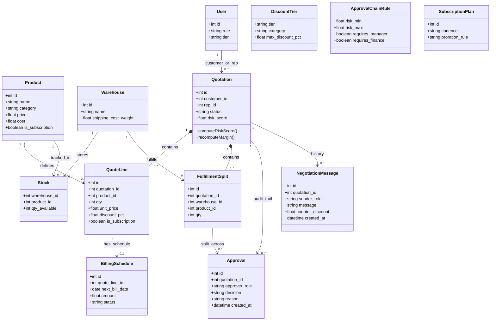

# DealFlow360 — Domain Model & Class Diagram

This document specifies the core domain entities, data attributes, behaviors, and relationships across the DealFlow360 Quote-to-Cash lifecycle.

---

## 1. Domain Class Diagram

---

## 2. Core Entities & Attributes

### 2.1 Identity & Governance
- **`User`**: System actor participating in the deal lifecycle.
  - `id`: Unique user identifier.
  - `role`: Role definition (`sales_rep`, `sales_manager`, `finance`, `admin`, `customer`).
  - `tier`: Account tier for customer users (`Standard`, `Silver`, `Gold`, `Platinum`).
  - *Relationships:* `1` User can author or be assigned `0..*` Quotations.
- **`DiscountTier`**: Policy defining maximum permissible discount before triggering escalations.
  - `tier`: Customer tier classification.
  - `category`: Product category (`Hardware`, `Software`, `Services`).
  - `max_discount_pct`: Ceiling discount allowed without management override.
- **`ApprovalChainRule`**: Risk-based routing thresholds.
  - `risk_min` / `risk_max`: Risk score boundaries.
  - `requires_manager`: Boolean flag requiring Sales Manager sign-off.
  - `requires_finance`: Boolean flag requiring Finance Controller sign-off.

### 2.2 Product & Fulfillment
- **`Product`**: Sellable catalog item.
  - `id`: Unique product identifier.
  - `name`: Product display name.
  - `category`: Hardware, Cloud, License, or Professional Services.
  - `price`: List / catalog base price.
  - `cost`: Unit cost base for margin analysis.
  - `is_subscription`: Boolean indicating whether item recurs.
  - *Relationships:* `1` Product defines `0..*` QuoteLine items, and is tracked in `0..*` Stock records across warehouses.
- **`Warehouse`**: Physical distribution center.
  - `id`: Unique warehouse identifier.
  - `name`: Distribution hub name (e.g. `Main Warehouse`, `East Depot`).
  - `shipping_cost_weight`: Cost multiplier used by the fulfillment engine when optimizing split shipments.
  - *Relationships:* `1` Warehouse stores `0..*` Stock and fulfills `0..*` FulfillmentSplit items.
- **`Stock`**: Inventory quantity state.
  - `warehouse_id`: Referenced warehouse.
  - `product_id`: Referenced product.
  - `qty_available`: Unreserved stock on-hand.

### 2.3 Quotation & Negotiation Lifecycle
- **`Quotation`**: The core aggregate root of the CPQ engine.
  - `id`: Quotation number (e.g. `Q-1042`, `QT-MTP0F1FF`).
  - `customer_id`: Referenced customer account.
  - `rep_id`: Referenced sales representative.
  - `status`: Deal status (`draft`, `pending_approval`, `approved`, `sent_to_customer`, `accepted`, `rejected`).
  - `risk_score`: Deterministic deal health metric (0–100 scale).
  - `computeRiskScore()`: Calculates discount magnitude, margin erosion, customer credit, and velocity risks.
  - `recomputeMargin()`: Computes blended gross margin across hardware, services, and subscription lines.
  - *Relationships:*
    - `1` Quotation contains `0..*` QuoteLines.
    - `1` Quotation contains `0..*` FulfillmentSplits.
    - `1` Quotation maintains an audit trail of `0..*` Approvals.
    - `1` Quotation retains a negotiation history of `0..*` NegotiationMessages.
- **`QuoteLine`**: Line-item details within a quotation.
  - `id`: Line identifier.
  - `quotation_id`: Owning quotation.
  - `product_id`: Catalog product.
  - `qty`: Quantity requested.
  - `unit_price`: Net unit selling price.
  - `discount_pct`: Percentage discount applied.
  - `is_subscription`: Flag indicating recurring billing.
  - *Relationships:* `1` QuoteLine links to `0..1` BillingSchedule for recurring lines.
- **`BillingSchedule`**: Recurring billing cadences and milestone schedules.
  - `id`: Schedule identifier.
  - `quote_line_id`: Associated recurring quote line.
  - `next_bill_date`: Calendar date for upcoming invoice generation.
  - `amount`: Scheduled recurring charge.
  - `status`: Subscription billing status (`active`, `paused`, `cancelled`).
- **`FulfillmentSplit`**: Multi-depot allocation partition.
  - `id`: Split identifier.
  - `quotation_id`: Associated quotation.
  - `warehouse_id`: Source distribution center.
  - `product_id`: Allocated product.
  - `qty`: Units allocated to this warehouse.
  - *Relationships:* Connects to `Approval` if split allocation requires freight exception override.
- **`Approval`**: Historic record in the governance chain.
  - `id`: Record identifier.
  - `quotation_id`: Associated quotation.
  - `approver_role`: Role performing the action (`sales_manager`, `finance`, `admin`).
  - `decision`: Verdict (`approved`, `rejected`, `counter_offered`).
  - `reason`: Justification or rejection rationale.
  - `created_at`: Timestamp.
- **`NegotiationMessage`**: Two-way customer portal communication log.
  - `id`: Message identifier.
  - `quotation_id`: Associated quotation.
  - `sender_role`: Sender (`customer` or `sales_rep`).
  - `message`: Counter-proposal text or redline note.
  - `counter_discount`: Requested revised discount percentage.
  - `created_at`: Timestamp.
